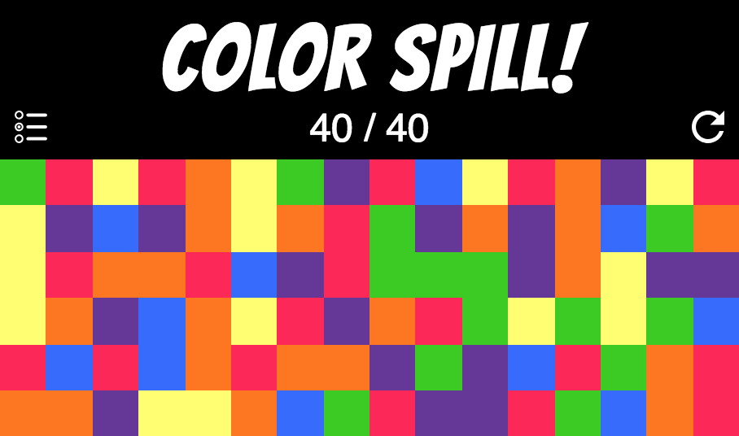
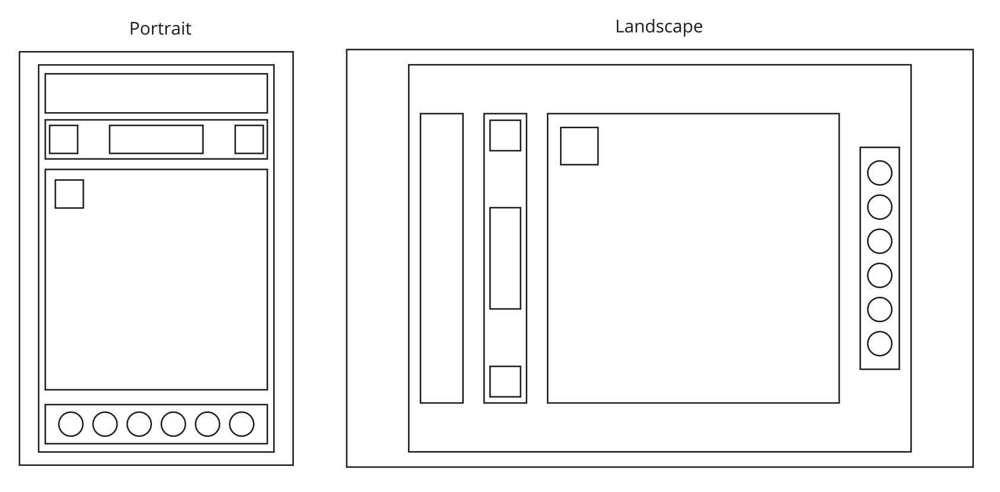

# Color Spill React!

Color Spill is an addictive casual game where the player starts with a grid beautifully populated with squares in random colors and strives to fill the entire grid with one color before running out of steps.

## What's New

Color Spill React! is the successor to my [WDI Project #1: Color Spill!](https://github.com/limjiechao/project-1)

It is completely rethought and revamped under the hood:
- Fast and efficient DOM refresh with *React*.
- New, non-recursive color filling algorithm using simple logic even kids can understand.
- Color-filling algorithm is constructed with JavaScript built-in objects like *Maps*, *Sets*, one-dimensional arrays and associative arrays (objects).
- CSS-only responsive resizing using, `vh`, `vw`, default wrapping and alignment behavior of flexbox.

# Where to Play

Play [Color Spill React!](https://limjiechao.github.io/color-spill-react)

You can also check out the *old* [Color Spill!](https://limjiechao.github.io/project-1)

## How to Play

- Fill the grid with by joining all the cells with one color before running out of moves.
- Pick the color shared by most adjacent cells to join with them.
- Maximize each move by striving to merge with clusters of cells sharing the same color.

# New Color-Filling Algorithm

- A JavaScript Map object is used to map every cell number to its color at the start.
	- Each time after a new color is chosen, filled cells will be mapped to the new color in the Map.
- A Javascript Set Object is used to track filled cells.
	- Each cell only occurs once in the Set regardless of how many times it has been added.
	- To determine whether the player has won the game, simply check that the size of the Set is equal to the total number of cells.
- Another JavaScript Map is used to map the cell number to an array containing the cell numbers of all its neighboring cells.
	- Every cell's neighbors are predetermined at the start.
	- Each time after a new color is chosen, the neighors of every filled cell would be checked to see if they are in the new color. If they are in the new color, they will be added to the Set of filled cells.

## Run-through of the Color-Filling Algorithm

- New fill color is choosen.
- Change the filled cells to new fill color.
- Check neighboring cells of filled cells and for those already in the new fill color, add them to filled cells
- Check `size` of filled cells Set. If size is equal to total number of cells, player has won the game.

# Wireframes

Only the portrait mode has been implemented. The landscape mode will be implemented in the near future.

